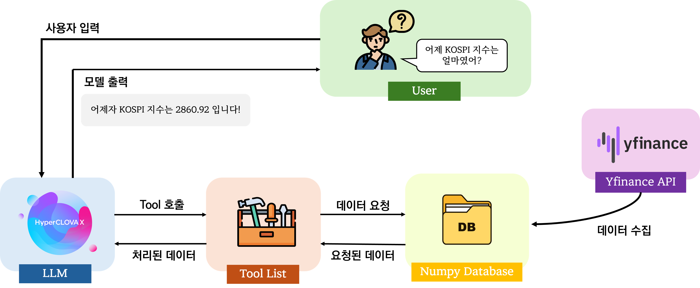

## 🏃‍➡️From Public Service to Public Heroes – 소집해제!

안녕하세요. 인공지능 학과 대학원생 2명으로 구성된 팀 소집해제 입니다. 아래 내용은 미래에셋증권 AI 페스티벌 'Fin Agent 개발' 설계 문서에 해당합니다. 
<br>
<br>

## ❓ API 사용법 

``` python
# python
import requests

URL = 'YOUR_API_URL'

API_KEY = CLOVA_API_KEY

headers = {
    'Authorization': f'Bearer {API_KEY}',
}

params = {'question': '삼성전자의 2025-07-25 종가는?'}
response = requests.get(URL, headers=headers, params=params)

print(response.text)
# "삼성전자의 2025년 7월 25일 종가는 **65,900원**입니다."
```

```bash
# bash
curl -X GET "YOUR_API_URL/agent?question=%ED%82%A4%EC%8A%A4%ED%8A%B8%EB%A1%A0%EC%9D%98+2025-01-01+%EA%B3%A0%EA%B0%80%EC%9D%80%3F" \
-H "Authorization: Bearer nv-4c..."
```
<br>


## 🙋‍♀️ Overall Pipeline

1. Yfinance api를 기반으로 데이터를 수집하여, numpy 기반 DB에 저장합니다.<br>
2. 사용자의 입력에 대해 clova는 tool List 중 입력에 적절하다고 판단하는 tool을 선택합니다.<br>
3. 선택된 tool을 활용, numpy db로부터 데이터를 가져온 후 데이터를 tool에서 처리합니다.<br>
4. 처리된 데이터는 clova에게 전달되고, 이를 기반으로 clova는 최종적인 응답을 생성합니다.<br>
<br>


## 💡 Our Strength
**Problem**<br>
Database로부터 요청된 데이터를 받아오는 시간이 생각보다 오래 소요된다는 것을 파악하였습니다.<br>
<br>
**Solution**<br>
이를 개선시키고자 numpy 기반의 데이터베이스를 구축하여 병렬처리를 가능하도록 하였고, 기존의 query 연산 속도보다 **100배** 이상 빠른 검색이 가능해졌습니다!<br>
<br>

## 🛠 Tool List
주어진 Task 1~4를 수행하기 위한 Tool List를 소개합니다! 🙋‍♂️

* <u>*simple_search*</u>
: 특정 일자의 시가, 종가, 고가, 저가, 거래량 반환

* <u>*search_top*</u>
: 특정 조건에 맞는 상위 종목 n개를 반환

* <u>*get_rate*</u>
: 등락률을 계산

* <u>*get_up_or_down_rate*</u>
: 특정 일자에 대해 상승률/하락률이 높은 n개의 종목을 반환

* <u>*count_with_status*</u>
: 특정 일자에 상승/하락/거래된 종목의 개수를 반환

* <u>*get_all_price*</u>
: 특정 일자의 전체 거래 대금을 반환

* <u>*kospi_kosdaq_index*</u>
: 특정 일자의 코스피/코스닥 지수를 반환

* <u>*RSI_compare_at_date*</u>
: 특정 일자에 RSI 기준과 비교하여 더 높거나 낮은 주식 정보 n개를 반환

* <u>*bollinger_compare_at_date*</u>
: 특정 일자에 볼린저밴드 하단/상단에 터치한 주식 정보 n개를 반환

* <u>*detect_dead_or_golden*</u>
: 특정 주식의 시점과 종점 사이에서 골든/데드 크로스 각각이 몇 번 발생했는지를 반환

* <u>*detect_dead_or_golden_all*</u>
: 시점과 종점 사이에서 골든/데드 크로스가 발생한 주식 정보를 n개를 반환

* <u>*is_above_ma*</u>
: 특정 일자에 일정 기간동안의 평균 거래량 / 종가가 일정 비율 이상인 주식 정보를 n개를 반환

* <u>*simple_search_with_range*</u>
: 특정 범위를 기준으로 데이터를 조회

* <u>*diff_with_range*</u>
: 거래량의 변화량 또는 등락률이 특정 범위 사이에 있는 데이터를 조회

* <u>*both_volume_rate*</u>
: 거래량의 변화량과 등락률 모두가 각각 원하는 조건에 해당하는 데이터를 조회
<br>


## 🪄 Additional Features (Task 5)

휴일에 해당하는 요청이 입력되는 경우, 휴일임을 알려주는 기능을 추가하였습니다. 🏖️

*예시:*
```
입력 - 삼성전자의 2025-07-27 종가는?
출력 - 요청하신 삼성전자의 2025년 7월 27일 고가는 해당 날짜가 일요일이기 때문에 데이터를 찾을 수 없습니다.
주식 시장은 주말 및 공휴일에는 열리지 않기 때문에 이러한 날짜에는 관련 정보가 제공되지 않습니다. 평일에 해당하는 다른 날짜에 대해 질문하시면 정확한 답변을 드릴 수 있습니다. 추가적인 도움이 필요하시다면 말씀해 주세요.
```

``` 
입력 - 삼성전자의 2025-07-27 종가는?
출력 - 2025년 1월 1일은 신정으로 인해 주식 시장이 열리지 않아 키스트론의 고가를 알 수 없습니다. 다른 날짜에 대해 궁금하신 정보가 있다면 말씀해 주세요.
```
